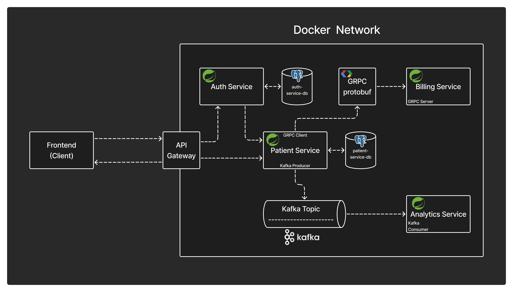

# Patient Management Microservices


A backend-focused Java Spring Boot microservices project for patient management, authentication, billing account creation, and analytics event processing. The project demonstrates REST APIs, API Gateway routing, JWT-based security, role-based authorization, gRPC communication, Kafka event streaming, PostgreSQL persistence, OpenAPI documentation, and Dockerized service builds.

---

## Architecture




The system is split into independent services:

- **API Gateway** routes external requests and validates protected patient API calls.
- **Auth Service** manages users, roles, JWT access tokens, refresh tokens, and Google OAuth login.
- **Patient Service** manages patient records and triggers billing and analytics workflows.
- **Billing Service** exposes a gRPC API for billing account creation.
- **Analytics Service** consumes patient events from Kafka.

---

## Services

| Service | Port | Responsibility |
| --- | ---: | --- |
| API Gateway | `4004` | Routes `/auth/**` and `/api/**`, applies JWT validation, exposes aggregated Swagger docs |
| Auth Service | `4005` | Registration, login, refresh tokens, logout, user management, roles, OAuth2 login |
| Patient Service | `4000` | Patient CRUD APIs, validation, PostgreSQL persistence, gRPC billing call, Kafka event publishing |
| Billing Service | `4001` | HTTP service plus gRPC server on `9001` for billing account creation |
| Analytics Service | - | Kafka consumer for patient events |

---

## Key Features

- Microservice-based backend architecture.
- Centralized routing with Spring Cloud Gateway.
- Stateless authentication using JWT access tokens.
- Refresh token rotation and revocation backed by database storage.
- Role-based authorization with `ROLE_GUEST` and `ROLE_ADMIN`.
- Google OAuth2 login support.
- Patient CRUD APIs with request validation and exception handling.
- Service-to-service communication using gRPC and Protocol Buffers.
- Event-driven processing using Kafka.
- Separate persistence ownership for Auth and Patient services.
- Swagger/OpenAPI documentation for API discovery.
- Dockerfile for each service.

---

## Request Flow

1. Client sends requests through the API Gateway.
2. Authentication requests are forwarded to the Auth Service.
3. Protected patient requests require a Bearer token.
4. Gateway validates tokens with the Auth Service before forwarding requests.
5. Patient Service persists patient data in PostgreSQL.
6. On patient creation, Patient Service calls Billing Service over gRPC.
7. Patient Service publishes a `PATIENT_CREATED` event to Kafka.
8. Analytics Service consumes the event asynchronously.

---

## Main APIs

### Auth Service

- `POST /v1/register`
- `POST /v1/login`
- `POST /v1/refresh`
- `POST /v1/logout`
- `GET /users/validate`
- `GET /users/validate-admin`
- User management APIs under `/users`

### Patient Service

Gateway path: `/api/patients`

- `GET /patients`
- `POST /patients`
- `GET /patients/{id}`
- `PUT /patients/{id}`
- `DELETE /patients/{id}`

### Billing Service

gRPC:

- `CreateBillingAccount(BillingRequest) returns (BillingResponse)`

### Analytics Service

Kafka:

- Topic: `patient`
- Event payload: Protocol Buffer `PatientEvent`

---

## Technology Stack

- Java 21
- Spring Boot
- Spring Cloud Gateway
- Spring Security
- Spring Data JPA / Hibernate
- PostgreSQL
- JWT (`jjwt`)
- OAuth2 Client
- gRPC
- Protocol Buffers
- Apache Kafka
- Maven
- Docker
- OpenAPI / Swagger
- Jakarta Bean Validation
- Lombok
- ModelMapper

---

## Project Structure

```text
.
|-- api-gateway
|-- auth-service
|-- patient-service
|-- billing-service
|-- analytics-service
`-- prompt-to-generate.md
```

---

## Running Locally

### Prerequisites

- Java 21
- Maven or included Maven wrappers
- PostgreSQL
- Kafka
- Docker, optional

There is currently no root `docker-compose.yml`. Each service includes its own `Dockerfile`, while infrastructure and networking must be configured separately.

Run any service from its directory:

```bash
./mvnw spring-boot:run
```

Build any service:

```bash
./mvnw clean package
```

Build a Docker image:

```bash
docker build -t patient-management/<service-name> .
```

---

## Environment Variables

### API Gateway

- `AUTH_SERVICE_URL`

### Auth Service

- `SPRING_DATASOURCE_URL`
- `SPRING_DATASOURCE_USERNAME`
- `SPRING_DATASOURCE_PASSWORD`
- `SPRING_JPA_HIBERNATE_DDL_AUTO`
- `SPRING_JPA_SHOW_SQL`
- `SPRING_JPA_PROPERTIES_HIBERNATE_DIALECT`
- `SPRING_JPA_PROPERTIES_HIBERNATE_FORMAT_SQL`
- `SPRING_SECURITY_OAUTH2_CLIENT_REGISTRATION_GOOGLE_CLIENT_ID`
- `SPRING_SECURITY_OAUTH2_CLIENT_REGISTRATION_GOOGLE_CLIENT_SECRET`
- `SECURITY_JWT_SECRET`
- `SECURITY_JWT_ISSUER`
- `SECURITY_JWT_ACCESS_TTL_SECONDS`
- `SECURITY_JWT_REFRESH_TTL_SECONDS`
- `SECURITY_JWT_REFRESH_TOKEN_COOKIE_NAME`
- `SECURITY_JWT_COOKIE_DOMAIN`
- `SECURITY_JWT_COOKIE_HTTP_ONLY`
- `SECURITY_JWT_COOKIE_SECURE`
- `SECURITY_JWT_COOKIE_SAME_SITE`

### Patient Service

- `SPRING_DATASOURCE_URL`
- `SPRING_DATASOURCE_USERNAME`
- `SPRING_DATASOURCE_PASSWORD`
- `SPRING_JPA_HIBERNATE_DDL_AUTO`
- `SPRING_SQL_INIT_MODE`
- `SPRING_KAFKA_BOOTSTRAP_SERVERS`
- `BILLING_SERVICE_ADDRESS`
- `BILLING_SERVICE_GRPC_PORT`

### Analytics Service

- `SPRING_KAFKA_BOOTSTRAP_SERVERS`

---

## Swagger

- API Gateway: `http://localhost:4004/swagger-ui.html`
- Auth Service: `http://localhost:4005/swagger-ui.html`
- Patient Service: `http://localhost:4000/swagger-ui.html`

---

## Backend Engineering Highlights

- Designed as separate services with clear responsibilities.
- Uses API Gateway for centralized routing and authorization checks.
- Implements stateless JWT authentication with refresh token lifecycle management.
- Uses gRPC for internal synchronous communication.
- Uses Kafka for asynchronous event-driven processing.
- Applies validation, exception handling, dependency injection, and layered service design.
- Uses OpenAPI documentation and Dockerized service builds for developer usability.

---

## Future Improvements

1. Add root Docker Compose setup for services and infrastructure.
2. Persist billing account data in Billing Service.
3. Add integration tests for gateway security, gRPC, and Kafka flows.
4. Add Spring Boot Actuator health checks.
5. Move shared protobuf files into a dedicated contract module.

---

## Author

**Name:** `Sujal Bendre`  
**GitHub:** `https://github.com/Suj018300`  
**LinkedIn:** `https://www.linkedin.com/in/bendresujal/`  
**Email:** `sujalbendre2526@gmail.com`
